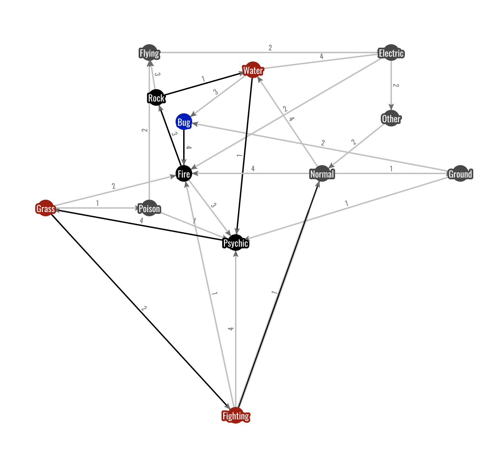
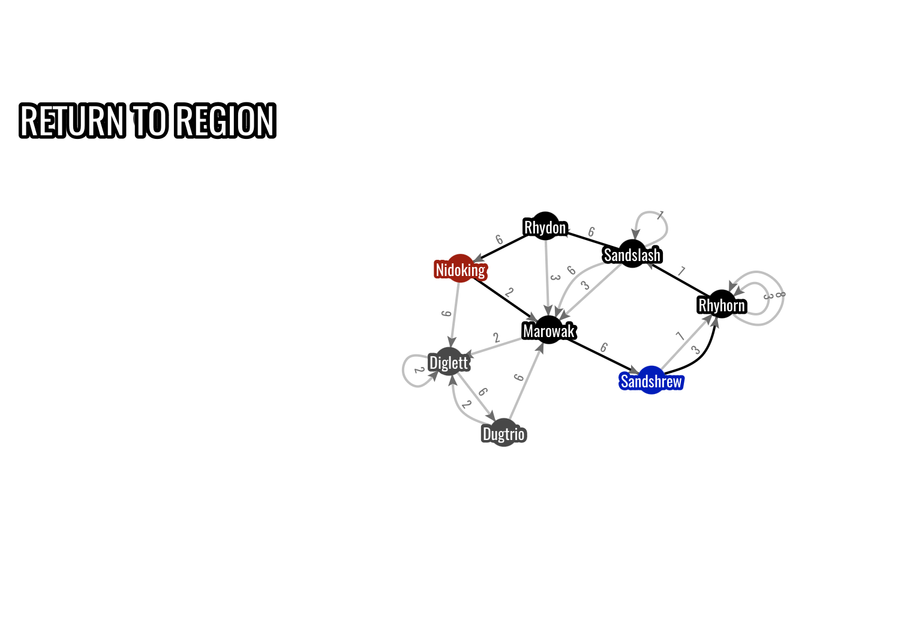

# Design and analysis of a shortest path algorithm
Brute force algorithm for visiting multiple target nodes while starting and ending at the same node. 
Written in python on pynode. 
 Blue: Home node
 Red: Target nodes
 Black: visited nodes

